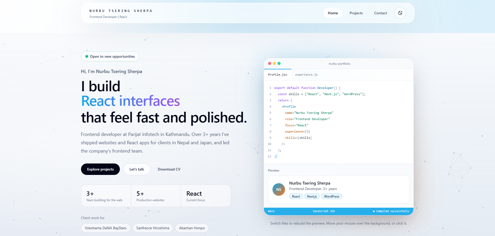

# Nurbu Tsering Sherpa — Frontend Developer Portfolio

Personal portfolio of **Nurbu Tsering Sherpa**, a frontend developer with 3+ years of experience building websites and React apps for clients in Nepal and Japan.

🔗 **Live site:** [nurbusherpa.com.np](https://nurbusherpa.com.np/)


<!-- Add a screenshot of the homepage at public/preview.png -->

---

## ✨ Features

- **Interactive hero.** A mock code editor rebuilds a live profile preview as you switch files, over an interactive canvas background.
- **Projects page.** Project cards are generated from a single data file, so adding work takes seconds.
- **Working contact form.** Messages are submitted through a Next.js Route Handler (`/api/contact`).
- **Dark / light mode.** Theme toggle that respects the visitor's preference.
- **Polished interactions.** Custom cursor, parallax sections, a skills carousel, and scroll-to-top, animated with Framer Motion.
- **Responsive layout.** Tested across screen sizes and browsers, from mobile to wide desktop.
- **Custom 404 page** and a downloadable CV.

---

## 🛠️ Tech Stack

| Layer      | Technology                              |
|------------|-----------------------------------------|
| Framework  | Next.js (App Router), React             |
| Styling    | Tailwind CSS                            |
| Animation  | Framer Motion                           |
| Backend    | Next.js Route Handlers                  |
| Hosting    | Vercel                                  |

---

## 📁 Project Structure

```text
app/
├── api/contact/route.js     # Handles contact form submissions
├── contact/page.jsx         # Contact page
├── projects/page.jsx        # Projects page
├── layout.jsx               # Root layout, fonts, metadata
├── not-found.jsx            # Custom 404 page
└── page.jsx                 # Home page

components/
├── hero/
│   ├── CodeWindow.jsx       # Mock editor that drives the live preview
│   └── HeroCanvas.jsx       # Interactive background
├── HeroSection.jsx
├── AboutSection.jsx
├── SkillsCarousel.jsx
├── ExperienceSection.jsx
├── ProjectPreviewSection.jsx  # Featured projects on the home page
├── ProjectCard.jsx
├── ContactForm.jsx
├── Navbar.jsx · Footer.jsx · SectionHeading.jsx
└── ThemeToggle.jsx · CustomCursor.jsx · ParallaxSection.jsx · ScrollToTop.jsx

data/projects.js             # Project list used by the projects pages
public/                      # Static assets and CV
styles/globals.css           # Global styles and Tailwind layers
utils/helpers.js             # Shared helper functions
```

---

## 🚀 Getting Started

**Prerequisites:** Node.js 18.18 or later

```bash
git clone https://github.com/nurbu-sherpa/nurbu.git
cd nurbu
npm install
cp .env.example .env.local   # then fill in your values
npm run dev
```

Open [http://localhost:3000](http://localhost:3000) in your browser.

### Environment variables

The contact form needs the following in `.env.local`:

| Variable             | Description                                 |
|----------------------|---------------------------------------------|
| `CONTACT_EMAIL`      | Address that receives contact messages      |
| `EMAIL_API_KEY`      | API key for your email service              |

<!-- Replace these with the variables your route.js actually reads. -->

### Available scripts

| Command         | Description                    |
|-----------------|--------------------------------|
| `npm run dev`   | Start the development server   |
| `npm run build` | Create a production build      |
| `npm run start` | Run the production build       |
| `npm run lint`  | Lint the codebase              |

---

## ✏️ Updating Content

- **Add a project:** add an entry to `data/projects.js`. It appears on `/projects` automatically, and on the home page if it's marked as featured.
- **Edit experience or skills:** update `ExperienceSection.jsx` or `SkillsCarousel.jsx`.
- **Replace the CV:** swap the file in `public/` and update the download link if the filename changes.

---

## 🌐 Deployment

Deployed on **Vercel**. Every push to `main` triggers a production deployment. Remember to add the environment variables in the Vercel project settings.

---

## 📬 Contact

- **Website:** [nurbusherpa.com.np](https://nurbusherpa.com.np/)
- **Email:** sherpanurbu15@gmail.com
- **LinkedIn:** [linkedin.com/in/your-profile](https://linkedin.com/in/nurbu-tsering-sherpa)
- **GitHub:** [github.com/your-username](https://github.com/nurbu-sherpa)

---

## 📄 License

The source code is available under the [MIT License](LICENSE). The personal content, including text, images, and CV, belongs to Nurbu Tsering Sherpa and may not be reused.
